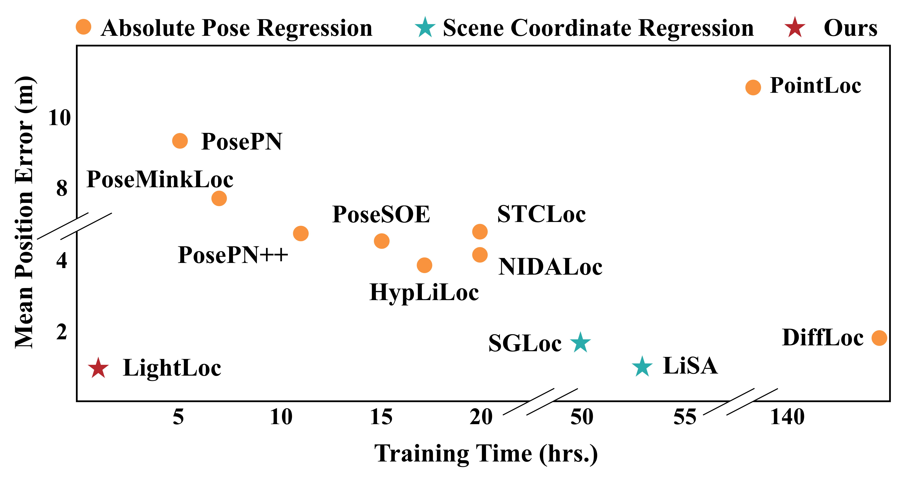

# LightLoc: Learning Outdoor LiDAR Localization at Light Speed

[Paper](https://openaccess.thecvf.com/content/CVPR2025/papers/Li_LightLoc_Learning_Outdoor_LiDAR_Localization_at_Light_Speed_CVPR_2025_paper.pdf) 
[Supp](https://openaccess.thecvf.com/content/CVPR2025/supplemental/Li_LightLoc_Learning_Outdoor_CVPR_2025_supplemental.pdf)
[Poster](https://drive.google.com/file/d/1Q5B6Ec4NN-NArkpaAjupIMamdCnwTknp/view?usp=sharing)



**LightLoc** is a fast and efficient framework for outdoor LiDAR-based localization. This repository provides the implementation of the LightLoc method, as described in our paper.

---
## Environment

### Requirements
- python 3.8

- pytorch 1.11

- cuda 11.3
### Installation
To set up the environment, run:
```
source install.sh
```

## Supported Datasets

LightLoc currently supports the following datasets:
- [Oxford Radar RobotCar](https://oxford-robotics-institute.github.io/radar-robotcar-dataset/datasets)
- [NCLT](https://robots.engin.umich.edu/nclt/)

### Dataset Structure
Organize the dataset directories as follows:

- Oxford
```
data_root
├── 2019-01-11-14-02-26-radar-oxford-10k
│   ├── velodyne_left
│   │   ├── xxx.bin
│   │   ├── xxx.bin
│   │   ├── …
│   ├── velodyne_left_calibrateFalse.h5
│   ├── velodyne_left_False.h5
├── …
```
- NCLT
```
data_root
├── 2012-01-22
│   ├── velodyne_left
│   │   ├── xxx.bin
│   │   ├── xxx.bin
│   │   ├── …
    ├── velodyne_sync
│   │   ├── xxx.bin
│   │   ├── xxx.bin
│   │   ├── …
│   ├── velodyne_left_False.h5
├── …
```
**Note:** 
- h5 ground truth files are provided in the [groundtruth](https://drive.google.com/drive/folders/1IAPbppgy88fr3KEgcKHJHUvdC0q1TJTo?usp=sharing).
- We use [nclt_process.py](nclt_process.py) to preprocess velodyne_sync to speed up data reading.
```
python nclt_process.py
```

## Train

#### (QE)Oxford

- Train classifier
```
python train.py --sample_cls=True --generate_clusters=True --batch_size=512 --epochs=50 --level_cluster=25
```
- Train regressor
```
python train.py --sample_cls=False --generate_clusters=False --batch_size=256 --epochs=25 --rsd=True --level_cluster=25
```
**Note:** To use the QEOxford dataset, uncomment line 81 in [lidarloc.py](datasets/lidarloc.py).
#### NCLT

- Train classifier
```
python train.py --sample_cls=True --generate_clusters=True --batch_size=512 --epochs=50 --level_cluster=100 --training_buffer_size=120000 --voxel_size=0.3
```
- Train regressor
```
python train.py --sample_cls=False --generate_clusters=False --batch_size=256 --epochs=30 --rsd=True --prune_ratio=0.15 --level_cluster=100 --voxel_size=0.3
```
## Test
####  (QE)Oxford
```
python test.py
```
####  NCLT
```
python test.py --voxel_size=0.3
```
**Note:** For results matching Table 3 in the paper, exclude lines 4300–4500 from the 2012-05-26 trajectory.

## Model Zoo
Pretrained models (backbone and scene-specific prediction heads) are available for download [here](https://drive.google.com/drive/folders/1ZuEs7NbVGO8afqTZM0xCYJgeLtNzPbt0?usp=sharing).

## Citation
If you find this codebase useful in your research, please cite our work:
```
@article{li2025lightloc,
  title={LightLoc: Learning Outdoor LiDAR Localization at Light Speed},
  author={Li, Wen and Liu, Chen and Yu, Shangshu and Liu, Dunqiang and Zhou, Yin and Shen, Siqi and Wen, Chenglu and Wang, Cheng},
  journal={arXiv preprint arXiv:2503.17814},
  year={2025}
}
```
This code builds on previous LiDAR localization pipelines, namely SGLoc and DiffLoc. Please consider citing:
```
@inproceedings{li2024diffloc,
  title={DiffLoc: Diffusion Model for Outdoor LiDAR Localization},
  author={Li, Wen and Yang, Yuyang and Yu, Shangshu and Hu, Guosheng and Wen, Chenglu and Cheng, Ming and Wang, Cheng},
  booktitle={Proceedings of the IEEE/CVF Conference on Computer Vision and Pattern Recognition},
  pages={15045--15054},
  year={2024}
}

@inproceedings{li2023sgloc,
  title={SGLoc: Scene Geometry Encoding for Outdoor LiDAR Localization},
  author={Li, Wen and Yu, Shangshu and Wang, Cheng and Hu, Guosheng and Shen, Siqi and Wen, Chenglu},
  booktitle={Proceedings of the IEEE/CVF Conference on Computer Vision and Pattern Recognition},
  pages={9286--9295},
  year={2023}
}
```
